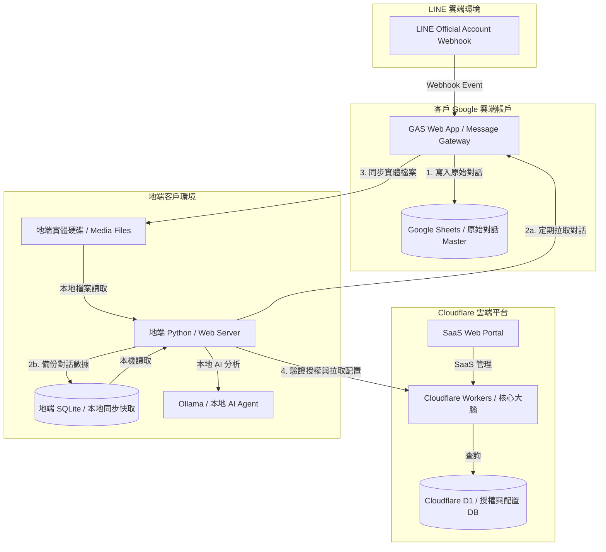

# 03 FALO IM Intelligence v2.x 架構說明

## 1. 架構核心理念

FALO IM Intelligence v2.x 採用 **「雲地協同 (Cloud-Edge Cooperation)」** 與 **「訊息網關分離 (Message Gateway Separation)」** 的混合式架構。

本版本之設計旨在達成以下三大商業與技術指標：
1. **核心技術保密 (IP Protection)**：將具價值的 AI Prompt 小幫手、KM 檢索與專利演算法等「大腦」鎖在 Cloudflare 或混淆編譯的地端 Python 中，防止逆向抄襲；而僅將一般的 Webhook 儲存腳本部署在客戶端。
2. **零伺服器資料庫開銷 (Zero DB Cost)**：利用客戶自有的 Google Sheets 作為 Master（主資料庫），免去我方為客戶託管與維護資料庫伺服器的軟硬體及資安維護成本。
3. **優異的離線與 Agent 處理效能 (Offline & Agent First)**：地端資料庫同步實體檔案與結構化對話，供地端 AI Agent (如本機 GPU 跑的 Ollama Llama/Gemma) 直接讀取本地路徑進行 OCR 與 RAG (知識庫比對) 分析。

---

## 2. 系統架構分工

本系統可劃分為三個核心元件層：

### 2.1 使用者介面 (User Interface)
* **雲端門戶 (Cloudflare Pages/Workers)**：提供全球低延遲、防 DDoS 攻擊的統一 SaaS 管理面板，便於客戶管理多個官方帳號與檢視綜合統計。
* **地端門戶 (Local Python Server)**：於局域網 (Intranet) 執行之網頁控制台，適合對資料私密性要求極高的離線環境。

### 2.2 資料庫 (Database - 雙軌 Master/Cache)
* **雲端網關資料庫 (GAS + Google Sheets)**：
  * 作為 **客戶端可見的 Master 資料庫**。
  * 數據所有權 100% 歸客戶所有，存放在客戶自己的 Google Drive，安全性高、客戶信任度好。
  * `Code.gs` 作為 **「Message Gateway (訊息網關)」**，僅處理 Webhook 寫入，並透過簡易 API 提供時間區間與 Chat ID 篩選讀取，不具備核心專利邏輯。
* **雲端配置資料庫 (Cloudflare D1 SQLite / KV)**：
  * 儲存多租戶帳號管理、授權期限、金鑰以及全域系統配置。
* **地端同步與快取資料庫 (Local SQLite)**：
  * 地端 Python 後台透過非同步任務（Pull 模式）從 GAS 網關同步最新對話，並將實體圖片與檔案下載落地至本地磁碟。

---

## 3. 地端同步資料庫之核心價值 (Why Local Sync DB?)

1. **實體檔案落地，賦能 Local Agent 應用**：
   AI Agent (如 OCR、語音轉文字、RAG 向量庫切片) 需要對圖片與文件進行高頻的物理存取。地端同步能將檔案存放在本地硬碟，避免網路下載延遲與流量超限 (Rate limit)，並能在本機直接呼叫 Ollama 進行去敏感化本地隱私運算。
2. **斷網高可用性 (Offline-First)**：
   地端 SQLite 擁有完整的對話快照。在客戶斷網時，地端系統仍能正常查詢與運作，網頁 100% 不卡頓。
3. **災難防護與數據還原 (DR - Disaster Recovery)**：
   Google Sheets 若被用戶誤刪或權限損壞，地端 SQLite 保留有 1:1 的完整鏡像備份，可隨時一鍵還原雲端數據。

---

## 4. 漸進式優化路線 (先求有，再求好)

1. **第一階段 (MVP 方案 - 先求有)**：
   * 地端 Python 不跑本地 DB 同步，而是直接發送 HTTP GET 請求向 GAS Message Gateway 撈取指定時間區間的對話，直接進行 AI 提煉。
   * **好處**：零配置、地端極簡、最快交付。
2. **第二階段 (效能快取 - 再求好)**：
   * 當客戶話量增大、Sheets 讀取變慢時，地端 Python 開啟背景排程，同步新訊息到本地 SQLite 快取。
   * 後台時間區間篩選改查地端 SQLite，流暢度大幅提昇。
3. **第三階段 (大規模商業化 - 雲地聯防)**：
   * 全面引進 Cloudflare Workers + D1 取代 GAS 作為雲端核心，邁向高規格資安、多租戶 SaaS 訂閱制。
