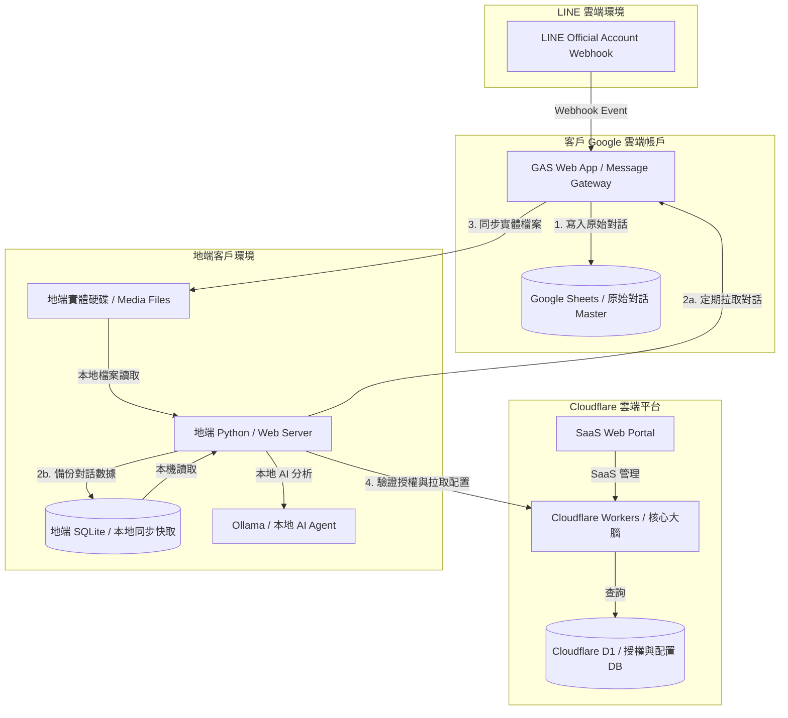

# 03 FALO IM Intelligence v2.x 架構說明

## 1. 架構核心理念

FALO IM Intelligence v2.x 採用 **「雲地協同 (Cloud-Edge Cooperation)」** 與 **「訊息網關分離 (Message Gateway Separation)」** 的混合式架構。

本版本之設計旨在達成以下三大商業與技術指標：
1. **核心技術保密 (IP Protection)**：將具價值的 AI Prompt 小幫手、KM 檢索與專利演算法等「大腦」鎖在 Cloudflare 或混淆編譯的地端 Python 中，防止逆向抄襲；而僅將一般的 Webhook 儲存腳本部署在客戶端。
2. **零伺服器資料庫開銷 (Zero DB Cost)**：利用客戶自有的 Google Sheets 作為 Master（主資料庫），免去我方為客戶託管與維護資料庫伺服器的軟硬體及資安維護成本。
3. **優異的離線與 Agent 處理效能 (Offline & Agent First)**：地端資料庫同步實體檔案與結構化對話，供地端 AI Agent (如本機 GPU 跑的 Ollama Llama/Gemma) 直接讀取本地路徑進行 OCR 與 RAG (知識庫比對) 分析。

---

## 2. 系統架構分工

本系統可劃分為三個核心元件層：



### 2.1 使用者介面 (User Interface)
* **雲端門戶 (Cloudflare Pages/Workers)**：提供全球低延遲、防 DDoS 攻擊的統一 SaaS 管理面板，便於客戶管理多個官方帳號與檢視綜合統計。
* **地端門戶 (Local Python Server)**：於局域網 (Intranet) 執行之網頁控制台，適合對資料私密性要求極高的離線環境。

### 2.2 資料庫 (Database - 雙軌 Master/Cache)
* **雲端網關資料庫 (GAS + Google Sheets)**：
  * 作為 **客戶端可見的 Master 資料庫**。
  * 數據所有權 100% 歸客戶所有，存放在客戶自己的 Google Drive，安全性高、客戶信任度好。
  * `Code.gs` 作為 **「Message Gateway (訊息網關)」**，僅處理 Webhook 寫入，並透過簡易 API 提供時間區間與 Chat ID 篩選讀取，不具備核心專利邏輯。
* **雲端配置資料庫 (Cloudflare D1 SQLite / KV)**：
  * 儲存多租戶帳號管理、授權期限、金鑰以及全域系統配置。
* **地端同步與快取資料庫 (Local SQLite)**：
  * 地端 Python 後台透過非同步任務（Pull 模式）從 GAS 網關同步最新對話，並將實體圖片與檔案下載落地至本地磁碟。

---

## 3. 地端同步資料庫之核心價值 (Why Local Sync DB?)

1. **實體檔案落地，賦能 Local Agent 應用**：
   AI Agent (如 OCR、語音轉文字、RAG 向量庫切片) 需要對圖片與文件進行高頻的物理存取。地端同步能將檔案存放在本地硬碟，避免網路下載延遲與流量超限 (Rate limit)，並能在本機直接呼叫 Ollama 進行去敏感化本地隱私運算。
2. **斷網高可用性 (Offline-First)**：
   地端 SQLite 擁有完整的對話快照。在客戶斷網時，地端系統仍能正常查詢與運作，網頁 100% 不卡頓。
3. **災難防護與數據還原 (DR - Disaster Recovery)**：
   Google Sheets 若被用戶誤刪或權限損壞，地端 SQLite 保留有 1:1 的完整鏡像備份，可隨時一鍵還原雲端數據。

---

## 4. 漸進式優化路線 (先求有，再求好)

1. **第一階段 (MVP 方案 - 先求有)**：
   * 地端 Python 不跑本地 DB 同步，而是直接發送 HTTP GET 請求向 GAS Message Gateway 撈取指定時間區間的對話，直接進行 AI 提煉。
   * **好處**：零配置、地端極簡、最快交付。
2. **第二階段 (效能快取 - 再求好)**：
   * 當客戶話量增大、Sheets 讀取變慢時，地端 Python 開啟背景排程，同步新訊息到本地 SQLite 快取。
   * 後台時間區間篩選改查地端 SQLite，流暢度大幅提昇。
3. **第三階段 (大規模商業化 - 雲地聯防)**：
   * 全面引進 Cloudflare Workers + D1 取代 GAS 作為雲端核心，邁向高規格資安、多租戶 SaaS 訂閱制。

---

## 5. SQL 導向之資料庫 Schema 與 API 規劃

為了確保 Google Sheets (目前的主儲存)、地端 SQLite (快取儲存) 與未來雲端 Cloudflare D1 (分散式儲存) 在架構上可以 **「無縫轉移、無痛對接」**，我們將所有的 Google Sheets 欄位規劃與 API 回傳格式，一律採取 **「SQL 關聯式資料庫 (Relational DB) 導向」** 設計。

### 5.1 單一 Google Sheets 試算表之 Sheets (工作表頁籤) Schema

全系統預設採用 **「單一 Google Sheets 主試算表檔案」** (例如：`Falo_Database`)，在內部劃分多個工作表頁籤（Sheets/Tabs），以此完整模擬 Relational DB 結構，避開檔案混亂。

#### A. 官方帳號設定工作表 (`bot_configs`)
* **用途**：儲存全系統的多個官方帳號基本金鑰設定與雲端硬碟綁定，僅在新增或修改帳號時更新。
* **試算表頁籤 / SQL 欄位定義**：
  | 欄位名稱 (Column) | 資料型態 (Type) | 說明 (Description) |
  |---|---|---|
  | `bot_alias` | `TEXT` | 主鍵，官方帳號唯一識別代稱 (e.g. `support`, `qa`) |
  | `bot_name` | `TEXT` | 官方帳號顯示名稱 |
  | `line_channel_token`| `TEXT` | LINE 官方 Channel Access Token |
  | `associated_drive_folder_id`| `TEXT` | 此帳號專屬的 Google Drive 備份資料夾 ID (Object Storage 目錄) |
  | `created_at` | `TIMESTAMP`| 建立時間 |

#### B. 對話事件記錄表 (`chat_events`)
* **用途**：儲存所有官方帳號 LINE Bot Webhook 即時事件，以及使用者手動上傳解析後的歷史對話紀錄。
* **試算表頁籤 / SQL 欄位定義**：
  | 欄位名稱 (Column) | 資料型態 (Type) | 說明 (Description) |
  |---|---|---|
  | `id` | `INTEGER` | 主鍵，自增序列 (PRIMARY KEY AUTOINCREMENT) |
  | `bot_alias` | `TEXT` | 識別此對話來自哪一個官方帳號 (e.g. `support`, `qa`) |
  | `chat_id` | `TEXT` | 對話群組/個人識別 ID (LINE 的 `groupId`, `roomId`, 或 `userId`) |
  | `message_id` | `TEXT` | LINE 官方訊息 ID (去重與更新實體媒體檔用) |
  | `captured_at` | `TIMESTAMP`| 系統捕獲該訊息的 ISO 8601 時間戳記 |
  | `sender_name` | `TEXT` | 發言者名稱 (e.g. `Force`, `Jerry`) |
  | `sender_role` | `TEXT` | **關鍵主從角色**：`host` (服務方/主) 或 `client` (需求方/從) |
  | `message_type` | `TEXT` | 訊息型態：`text`, `image`, `file`, `system_event` |
  | `text_content` | `TEXT` | 對話純文字內容 |
  | `metadata_json` | `TEXT` | 存放圖片 URL、貼圖 ID 等非結構化中繼資料的 JSON 欄位 |

#### C. AI 戰情與任務表 (`ai_insights`)
* **用途**：儲存大模型分析後的對話摘要、行動待辦事項、風險警告以及 KM 新增備忘。
* **試算表頁籤 / SQL 欄位定義**：
  | 欄位名稱 (Column) | 資料型態 (Type) | 說明 (Description) |
  |---|---|---|
  | `id` | `INTEGER` | 主鍵，自增序列 |
  | `chat_id` | `TEXT` | 此分析所屬之群組或對話識別 ID |
  | `analysis_type` | `TEXT` | 分析類型：`summary`, `task_list`, `risk_alert`, `km_memo` |
  | `time_range_start`| `TIMESTAMP`| 被分析對話的起點時間 |
  | `time_range_end`  | `TIMESTAMP`| 被分析對話的終點時間 |
  | `summary_markdown`| `TEXT` | AI 生成的 Markdown 格式分析報告主體 |
  | `tasks_json` | `TEXT` | **結構化任務欄位**：包含 `[{"assignee": "Force", "task": "補報價單", "due": "2026-07-05"}]` 的 JSON 陣列 |
  | `created_at` | `TIMESTAMP`| 分析生成時間 |


---

### 5.2 外部呼叫 API 之「SQL 化協定」

當外部 (地端 Python 或 Cloudflare Worker) 向 GAS 請求數據時，**預設不使用 Google Sheets 特有的 Cell 範圍物件**，而是全面模擬標準的 SQL 查詢接口：

#### A. 查詢 API 請求 (GET 參數化規格)
```
GET https://script.google.com/macros/s/{GAS_ID}/exec
  ?action=query
  &table=chat_events
  &chat_id=group_test
  &start_date=2026-06-25T00:00:00Z
  &end_date=2026-06-30T23:59:59Z
  &limit=100
  &token={VIEWER_TOKEN}
```
* 參數映射：
  * `table` ➡️ SQL `FROM`
  * `chat_id`, `start_date`, `end_date` ➡️ SQL `WHERE` 條件過濾
  * `limit` ➡️ SQL `LIMIT` 限制

#### B. API 回傳格式 (標準 JSON 物件陣列)
GAS 回傳的資料結構必須轉換為標準的 **「Relation rows JSON 陣列」**，以便地端 Python / Cloudflare 可直接執行 `INSERT INTO local_db` 或映射至 Python ORM。
```json
{
  "ok": true,
  "count": 2,
  "data": [
    {
      "id": 128,
      "bot_alias": "support",
      "chat_id": "group_test",
      "message_id": "msg_987654",
      "captured_at": "2026-06-25T10:30:00+08:00",
      "sender_name": "Jerry",
      "sender_role": "client",
      "message_type": "text",
      "text_content": "那個報價單記得補上喔",
      "metadata_json": "{}"
    },
    {
      "id": 129,
      "bot_alias": "support",
      "chat_id": "group_test",
      "message_id": "msg_987655",
      "captured_at": "2026-06-25T10:31:00+08:00",
      "sender_name": "Force",
      "sender_role": "host",
      "message_type": "text",
      "text_content": "好的，下午提供",
      "metadata_json": "{}"
    }
  ]
}
```

---

### 5.3 雲端硬碟權限設計與位置隨動機制 (Google Drive Folder Following & Permission Inheritance)

為了貫徹「**初始環境設定最小化原則**」，v2.x 捨棄了過去需要手動在 Google Drive 建立資料夾並複製填寫 Folder ID 的繁瑣步驟，改採「**自動位置跟隨與建檔**」設計：

#### A. 偵測與跟隨母資料夾 (Folder Following)
當 GAS 執行時，若 `bot_configs` 的 `associated_drive_folder_id` 欄位為空白，程式將自動偵測目前試算表檔案 (`Falo_Database`) 所在的資料夾：
```javascript
var currentFile = DriveApp.getFileById(ss.getId());
var parentFolder = currentFile.getParents().next(); // 偵測並鎖定母資料夾
```

#### B. 權限繼承與自動建檔 (Permission Inheritance & Auto Creation)
* 系統隨即在該母資料夾下，自動建立以該 Bot 名稱命名之子資料夾（如 `Bot_standard`）。
* **資安優勢**：在 Google Drive 中，子資料夾會自動繼承母資料夾之共用權限設定。藉由此機制，擁有試算表存取權限之客戶團隊，將自然擁有對應對話記錄子資料夾的讀寫權限，不需再手動逐一共享。
* **自動回填**：GAS 建立完子資料夾後，會自動將產生的 `Folder ID` 回填寫入 `bot_configs` 工作表中，供後續快速存取，達成零手動、開箱即用的極簡體驗。


